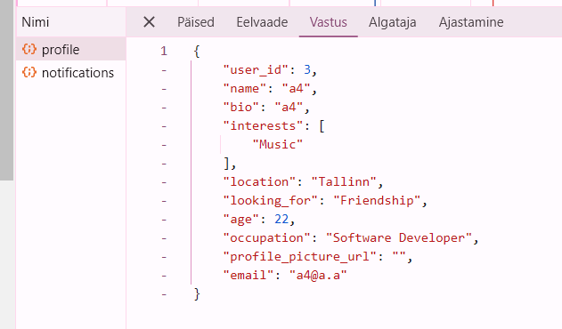
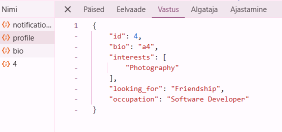

# Match Me

A modern matchmaking platform built with Go and React, designed to connect people based on shared interests and compatibility scores.

## Features

- **Smart Matching Algorithm**:
  - Calculates interest compatibility (50% weight) based on shared interests
  - Considers age compatibility (30% weight) with higher scores for closer age ranges
  - Factors in intention matching (20% weight) for users looking for the same thing
  - Only shows matches with a total score >= 30%
  - Prioritizes users who have already liked the current user

- **Real-time Features**:
  - Live chat with matches
  - Online/offline status indicators
  - Unread message notifications

## System Requirements

- Go 1.22 or higher
- PostgreSQL 13 or higher
- Node.js 16 or higher
- npm 8 or higher

## Installation and Setup

### Backend Setup

1. Create a database called "matchme":
```bash
cd backend
psql -U postgres
CREATE DATABASE matchme;
\q
```

2. Initialize the database schema:
```bash
cd backend
psql -U postgres -d matchme -f init.sql
```

3. Run the backend server:
```bash
cd backend
go mod tidy
go run main.go
```

The backend server will start on http://localhost:3000

### Frontend Setup

1. Install dependencies and start the development server:
```bash
cd frontend
npm install
npm run dev
```

The frontend application will be available at http://localhost:8080

### Creating Test Users

Generate test users (1-100) using:
```bash
curl -X POST http://localhost:3000/api/test/generate-users?count=100
```

## Project Structure

### Backend
- `/handlers`: Request handlers for different features
  - `auth.go`: Authentication handlers
  - `chat.go`: Real-time chat functionality
  - `match.go`: Matching logic
  - `profile.go`: Profile management
  - `user.go`: User management
  - `status.go`: Online/offline status
  - `upload.go`: File upload handling

### Frontend
- `/src/components`: React components
- `/src/pages`: Page components
- `/src/constants`: Configuration constants
- `/src/lib`: Utility functions
- `/src/types`: TypeScript type definitions

## API Endpoints

### Authentication
- POST `/api/auth/signup`: Register new user
- POST `/api/auth/login`: User login

### Profile
- GET `/api/me/profile`: Get current user's profile
- PUT `/api/me/profile`: Update profile
- GET `/api/users/:id`: Get user's basic info
- GET `/api/users/:id/profile`: Get user's profile info
- GET `/api/users/:id/bio`: Get user's biographical data

### Matching
- GET `/api/recommendations`: Get potential matches
- POST `/api/matches/:id/dismiss`: Dismiss a recommendation

### Connections
- POST `/api/matches/:id/connect`: Send connection request
- GET `/api/matches`: Get current connections
- PUT `/api/matches/:id/accept`: Accept connection request
- PUT `/api/matches/:id/reject`: Reject connection request

### Chat
- WebSocket `/ws`: Real-time chat and status updates

## Database Configuration

The application uses the following database configuration:
```env
DB_HOST=localhost
DB_PORT=5432
DB_NAME=matchme
DB_USER=postgres
DB_PASSWORD=postgres
```

## Development Notes

- The matching algorithm uses weighted scoring for compatibility
- WebSocket connections handle real-time chat and status updates
- Profile pictures are stored as URLs in the database
- Authentication uses JWT tokens
- All API endpoints require authentication except signup and login

## Fixes
- Age bug fix, age cannot be negative
- Added profile pages for users, profiles can be accessed from matches and by clicking on name in matches tab.
- Websocket messages fix, messages go in realtime. Notifications on header also update in realtime.
- User can now filter potential matches by Age(closest to), Looking for(same first), Interests(the more the better). User can filter by location also, but that change has to be made in profile. **Database update needed, use init.sql**
- Email added to profile page.
- The profile endpoint does return "about me" information. For your own profile usage : curl -X GET http://localhost:3000/api/me/profile   -H "Authorization: YOUR BEARER TOKEN HERE". **Also can be seen in dev tools**


- For other users about me information usage : curl -X GET http://localhost:3000/api/users/ID/profile   -H "Authorization: YOUR BEARER TOKEN HERE"

- The users endpoint returns 404 when not authorized. Can be seen in console or curl -X GET http://localhost:3000/api/users/ID -H "Authorization: Bearer YOUR BEARER TOKEN HERE"
- Added typing indicator.
